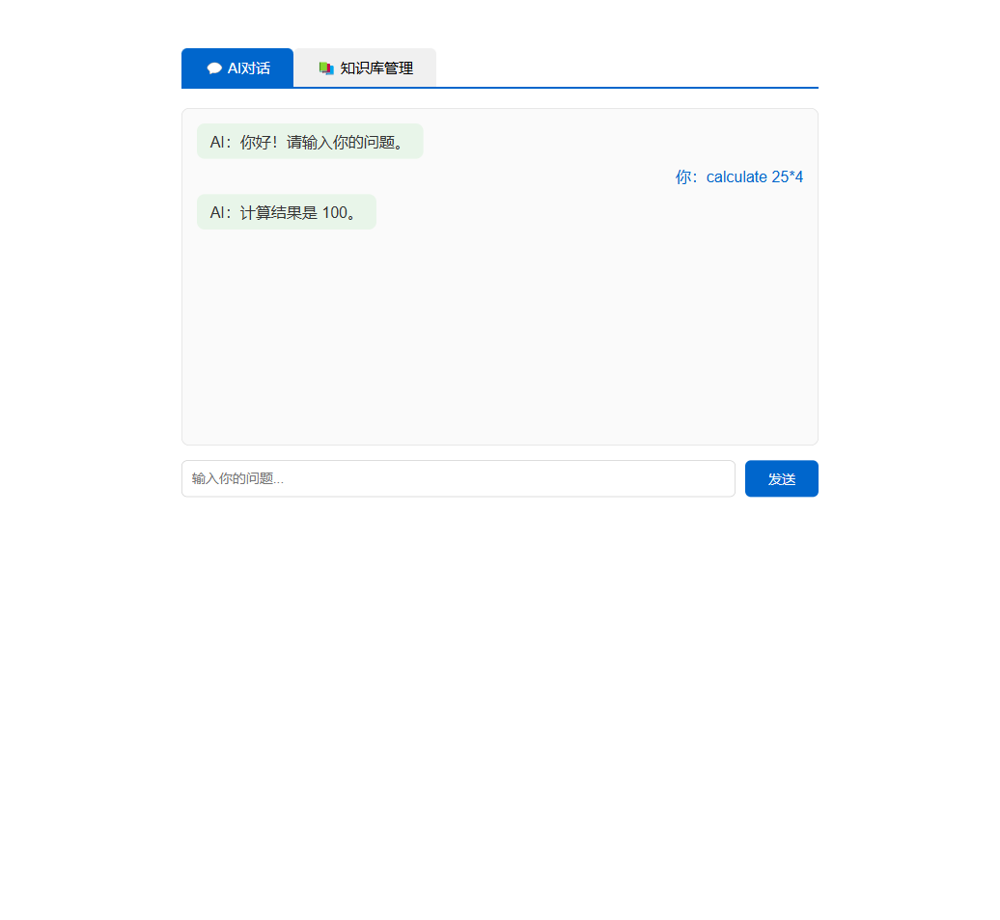
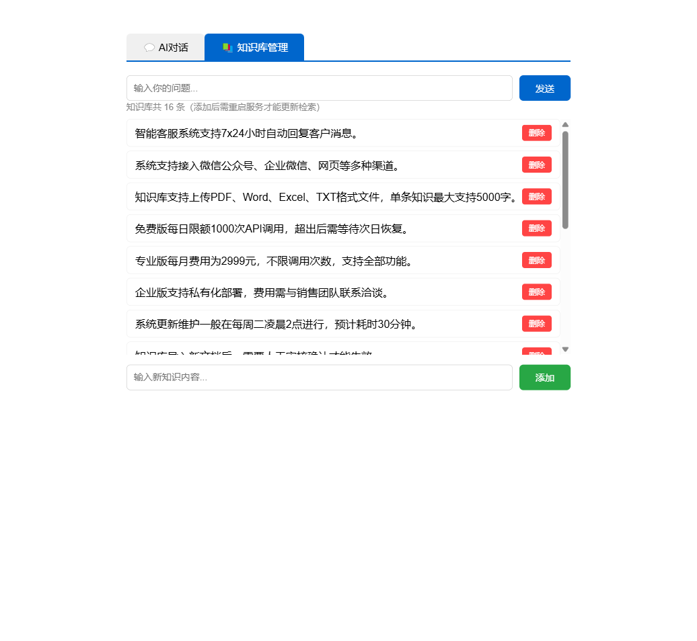

# RAG 智能问答系统

基于 Spring Boot + Spring AI + 通义千问 的 RAG 智能问答系统。
用户提问后从本地知识库检索相关内容，让 AI 基于真实资料回答，避免胡说八道。

## 功能特性

- **AI 对话** — 基于 Spring AI 框架，集成阿里云通义千问大模型
- **向量知识库** — 使用 Embedding API + 余弦相似度，实现语义级别的知识检索
- **知识库管理** — 网页端增删知识，实时生效，支持浏览器端管理
- **流式输出** — 打字机效果逐字显示，提升交互体验
- **Agent 工具调用** — AI 可自动调用工具（数学计算、日期查询等）
- **Redis 缓存** — 热门问答缓存 1 小时，相同问题秒回

## 运行截图

## 技术栈

- Java 17 + Spring Boot 3.4.4
- Spring AI 1.0.0-M6.1（阿里云 DashScope）
- Redis（数据缓存）
- Maven

## 快速启动

1. 在 `application.properties` 中填入你的阿里云 API Key
2. 确保 Redis 已启动（默认端口 6379）
3. 运行 `mvn spring-boot:run`
4. 浏览器打开 `http://localhost:8080`

## 项目结构

- `ChatController.java` — 对话接口 + 流式输出 + Redis 缓存
- `DocumentSearchService.java` — 向量知识库检索
- `EmbeddingService.java` — Embedding API 调用
- `KnowledgeService.java` — 知识库数据管理
- `KnowledgeController.java` — 知识库增删接口
- `AgentTools.java` — AI Agent 工具（计算、日期等）
- `knowledge.txt` — 初始知识库数据

## GitHub

github.com/Hanyu923/RAG-QA-System
